<div align="center">


<br>

**The registration desk for a school or college club.**
Browse fests, register in a minute, pay by bKash, and get a QR ticket that gets scanned at the gate.

<br>

[](https://stub-drmc.vercel.app)
[](SCORECARD.md)
[](LICENSE)
[](index.html)
[](#5-setup-instructions)

[](https://vercel.com/new/clone?repository-url=https://github.com/tahsanmasum/stub)

<sub>Built for the **AI Web Development Contest**, 9th DRMC International Tech Carnival 2026 · theme: *Smart Club Operations*</sub>

</div>

<br>



<br>

---

<div align="center">

## For the judges, first

</div>



**Every scoring line in the rulebook is quoted verbatim and mapped to the exact screen that satisfies it, with a 4-minute route through all of them, in → [SCORECARD.md](SCORECARD.md)**

The site loads with **4 fests, 11 events, ~300 registrations, 130 accounts and 279 payment records already in it.** Nothing needs to be created before you can judge it.

<div align="center">

### Or just try it, in 60 seconds

| | |
|---|---|
| **1** | Open the [live demo](https://stub-drmc.vercel.app) — sample data is already loaded |
| **2** | Register for **AI Web Development Contest**. On the payment step, type the promo code `VOLUNTEER` |
| **3** | Open **Organizer** → sign in with `organizer@stub.demo` / `carnival2026` |
| **4** | Go to **Check-in**, paste the ticket code you just got, and watch the ticket get punched |

</div>

---

## Contents

<table>
<tr>
<td valign="top" width="50%">

1. [Project name](#1-project-name)
2. [Project description](#2-project-description)
3. [Features](#3-features)
   · [Task 1 — Fest Directory](#task-1--fest-directory-30-pts)
   · [Task 2 — Registration System](#task-2--registration-system-30-pts)
   · [Task 3 — Organizer Management](#task-3--organizer-management-30-pts)
   · [Task 4 — Bonus, ranked](#task-4--bonus-30-pts--the-extra-features-ranked)
4. [Tech stack](#4-tech-stack)
5. [Setup instructions](#5-setup-instructions)
6. [Deployment URL](#6-deployment-url)
7. [Demo credentials](#7-demo-credentials)

</td>
<td valign="top" width="50%">

8. [Third-party services and APIs](#8-third-party-services-and-apis)
9. [AI tools used](#9-ai-tools-used)
10. [Screenshots](#10-screenshots)
11. [Known limitations](#11-known-limitations)
12. [License](#12-license)
13. [Rules and decisions](#13-rules-and-decisions)

<br>

**Also in this repo**
[`SCORECARD.md`](SCORECARD.md) — rubric line by rubric line
[`DEPLOY.md`](DEPLOY.md) — GitHub → Vercel → Firebase
[`firestore.rules`](firestore.rules) — the security model

</td>
</tr>
</table>

---

## 1. Project name

# Stub

Named after the part of a ticket you keep.

---

## 2. Project description

Most school and college clubs run registration on a Google Form, then copy the rows into a spreadsheet, then chase people on Messenger to confirm payments, then print an attendance sheet and tick names off with a pen at the gate.

**Stub replaces that whole chain** with one site that follows the structure clubs actually have:

```
Organization        →  Fest                →  Event                      →  Registration
DRMC IT Club           Tech Carnival 2026     AI Web Development Contest    TC26-9F7A2B
```

A visitor browses fests, opens an event, fills a short form, sends the entry fee by bKash and types the transaction ID. The organizer matches that TrxID against their bKash statement with one click, and the registration turns into a confirmed QR ticket. On the day, a volunteer scans that QR at the gate with a phone.

Everything in between — waitlists, team invite links, promo codes, refunded seats, unfinished forms, Bangla, confirmation emails, printable ID badges — is handled by the same single file.

<br>

<div align="center">
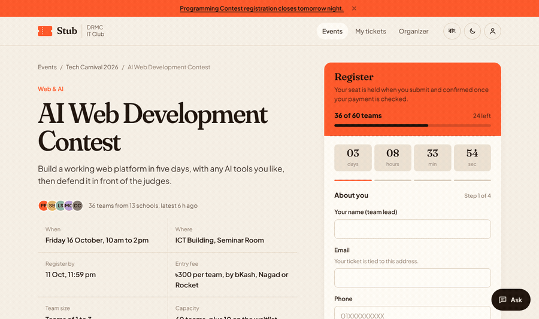
<br><sub><b>Register → pay by bKash → get a ticket.</b> Recorded from the running app.</sub>
</div>

---

## 3. Features

Organised in the rulebook's own order: the three scored tasks first, each feature tagged with the scoring line it answers, then the bonus work ranked into tiers.

<br>

<div align="center">

| Task | Points | Section |
|---|---|---|
| Fest Directory | 30 | [↓](#task-1--fest-directory-30-pts) |
| Registration System | 30 | [↓](#task-2--registration-system-30-pts) |
| Organizer Management | 30 | [↓](#task-3--organizer-management-30-pts) |
| Bonus — creative work | 30 | [↓](#task-4--bonus-30-pts--the-extra-features-ranked) |

</div>

---

### Task 1 — Fest Directory (30 pts)

<table>
<tr><td width="58%">

**`1.1` Display available and upcoming fests**
Four fests, sorted by what matters now — *happening → upcoming → past*. Each carries dates, venue, event count and a live state: `Registration open`, `Coming up`, `Finished`.

**`1.2` Event cards with useful information**
No card is a bare title. Every one shows date, category, fest, team size, deadline, a **live seat meter**, the fee and a state label (`Open` · `Closes tomorrow` · `Full, waitlist open` · `Registration closed`).

**`1.3` Search events**
One bar in the hero, filtering as you type across titles, categories, fest names, venues and summaries. Try `robot`, `quiz`, `hack`.

**`1.4` Categories and filters**
Category chips **with live counts**, plus three dropdowns — fest, availability (`Taking registrations` · `Closing in 48 hours` · `Full or waitlist` · `Not taking registrations` · `Everything incl. past`) — and three sort orders.

**`1.5` Open an event to a details page with deadline and capacity**
**Register by** date, **Capacity** spelled out (*16 teams, plus 6 on the waitlist*), a live countdown, a fill meter, rules, prizes, venue and any organizer notice.

**`1.6` General UX and responsiveness**
Light and dark theme, বাংলা and English, verified clean at 390 / 768 / 834 / 1024 / 1440 px.

</td><td width="42%">

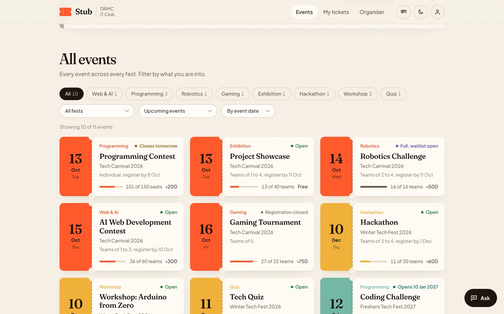
<sub>`1.2`–`1.4` — cards, chips with counts, three filters</sub>

<br><br>

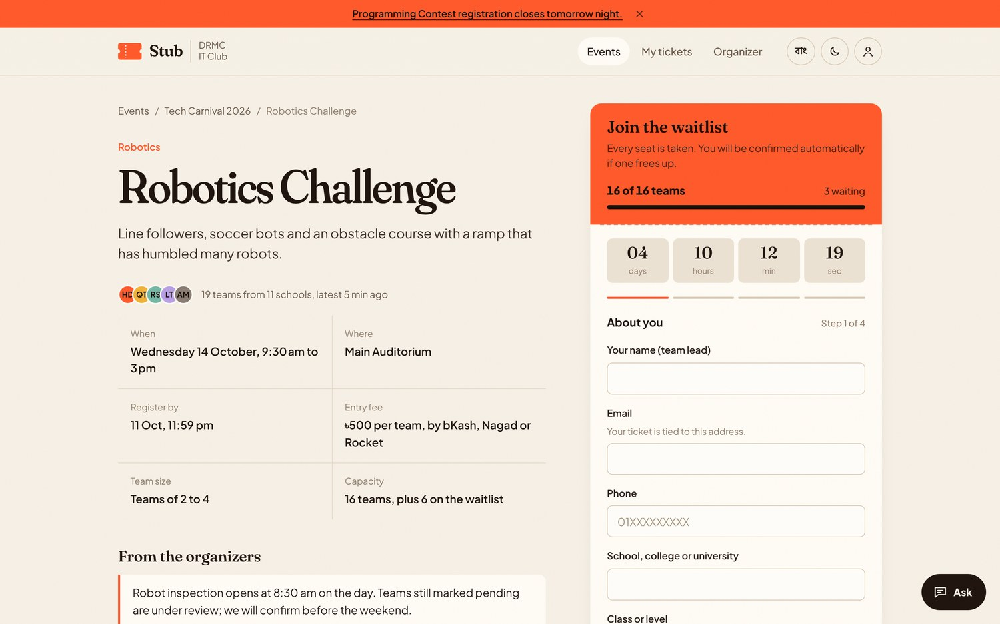
<sub>`1.5` — deadline, capacity, countdown, seat meter</sub>

</td></tr>
</table>

**Also here, beyond the scoring lines:** day-by-day fest programme · homepage news from organizers · a countdown to the next fest · a school leaderboard · trending events · an editable FAQ and partners strip.

---

### Task 2 — Registration System (30 pts)

<table>
<tr><td width="42%">

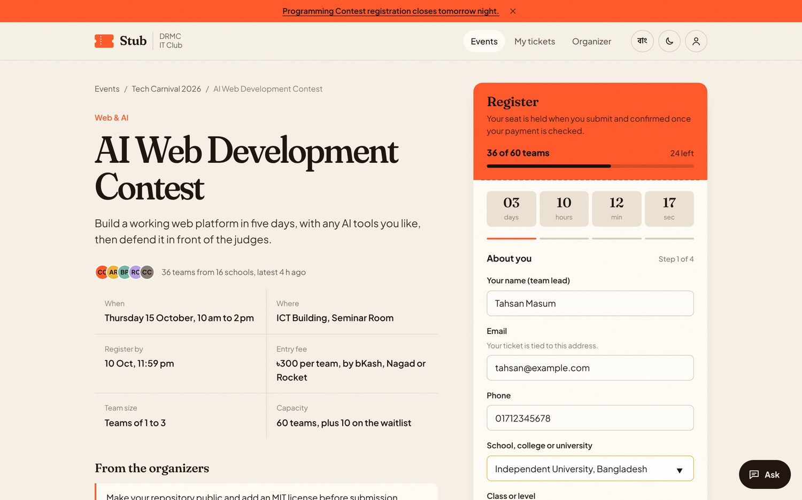
<sub>`2.1`–`2.2` — multi-step form with inline validation</sub>

<br><br>

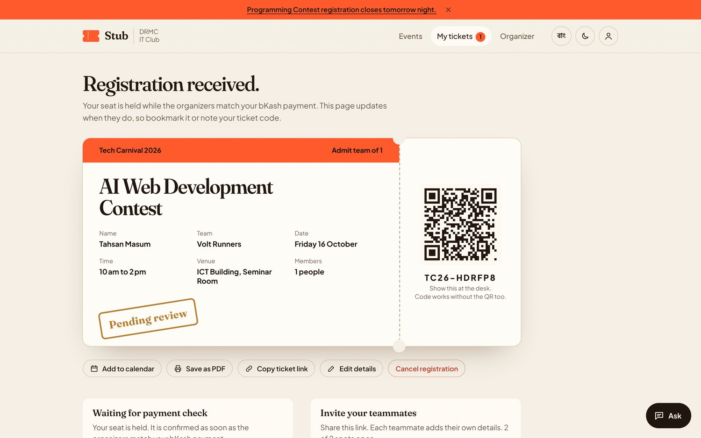
<sub>`2.3` — the ticket that comes out</sub>

</td><td width="58%">

**`2.1` Users can register for an event**
A four-step form — **about you → team → payment → review**. No account needed; a guest can register and still manage the ticket afterwards.

**`2.2` The form works correctly**
Inline validation for Bangladeshi phone format, email, team size against the event's own min and max, URL answers and transaction-ID format. Errors appear under the exact field and clear as you fix them.

**`2.3` Registration confirmation**
A printable **admit-one ticket** with a QR code, a ticket code (`TC26-…`), a status stamp and the invite link for teammates — reachable later at `#/tickets/<code>`, and emailed when email is configured.

**`2.4` Limits and deadlines work**
Four events are deliberately left in four different states so this is testable without waiting:

| Event | State |
|---|---|
| Robotics Challenge | **Full** → offers the waitlist |
| Gaming Tournament | **Deadline passed** |
| Coding Challenge | **Not open yet** |
| Programming Contest | **Closing within 48 h** |

Each refuses with its own specific reason rather than a generic error. Duplicate emails on the same event are blocked, and **a transaction ID can never be used twice**.

**`2.5` View and manage your registration**
**My tickets** — edit details, cancel (the seat returns to the waitlist), resubmit a rejected payment, add to calendar, save as PDF, copy the link. On a different device, recover a ticket with **code + email**.

**`2.6` General functionality**
Progress is saved if you reload mid-form. A **schedule-clash warning** fires when two of your events overlap. A 100% promo code skips payment entirely.

</td></tr>
</table>

#### The payment desk

Participants pay by **bKash, Nagad, Rocket, Upay or bank**, then enter the TrxID and the number they paid from. Cash at the desk is allowed per event.

<table>
<tr><td width="42%">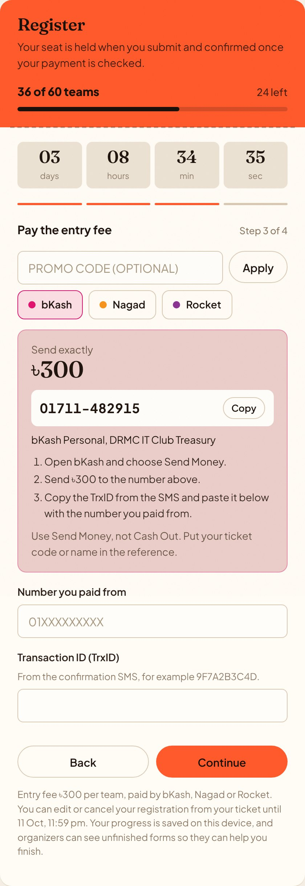</td>
<td width="58%">

- The exact amount, the number with a **copy button**, and step-by-step instructions
- **A transaction ID can never be used twice** — blocked in the browser *and* by a Firestore rule
- Organizers verify from a dedicated desk, or paste their **whole bKash statement** and every matching TrxID verifies at once
- Rejected payments come back with a reason and a **resubmit** form on the participant's own ticket
- Check-in refuses an unpaid ticket until the fee is collected

</td></tr>
</table>

---

### Task 3 — Organizer Management (30 pts)

<div align="center">
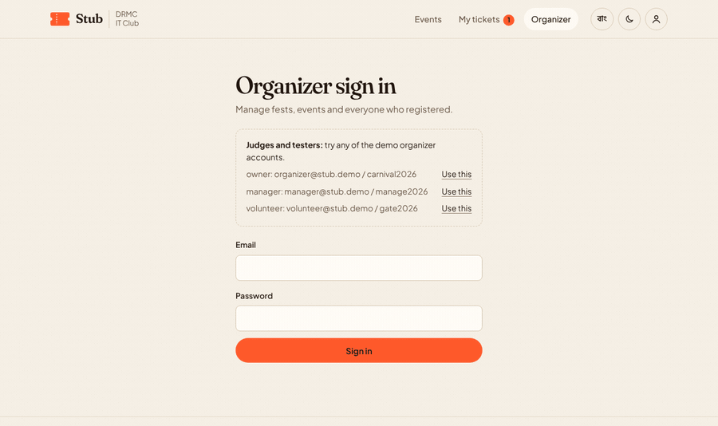
<br><sub>Overview → live monitor → payments → check-in, recorded from the running dashboard.</sub>
</div>

<br>

**`3.1` Organizer dashboard**
A KPI row, a 14-day registration chart, a *needs attention* queue, seats by event, top institutions and the latest registrations — plus **Today's briefing**, a written summary of the day generated by plain code from the live data, no AI involved.

**`3.2` View registered participants**
The full table of all ~300: name, email, event, team, institution, registered-at, payment state and status. Click any row for a detail drawer with their answers, team members, payment trail, history and private organizer notes.

**`3.3` Search and filter participants**
Search spans name, email, phone, team name, team members and ticket code. Filter by fest, event, status and payment state, in any combination.

**`3.4` Manage participant status**
Change any registration inline to confirmed / pending / waitlisted / rejected / cancelled / checked-in. Select rows for **bulk** confirm, waitlist, reject, check-in or export. Add walk-ins, delete registrations, verify or reject payments.

**`3.5` Statistics and management tools**
A drop-off funnel (*visited → opened an event → started a form → registered → paid*), a visits-by-hour heatmap, device and traffic-source splits, per-event conversion, money collected vs. awaiting, CSV exports everywhere, printable sign-in sheets and ID badges, fest recreation, and full backup and restore.

**`3.6` General tool responsiveness**
On small screens the sidebar becomes a scrollable tab strip and every dashboard table becomes stacked cards — verified clean at every tablet and phone size.

<table>
<tr>
<td width="50%">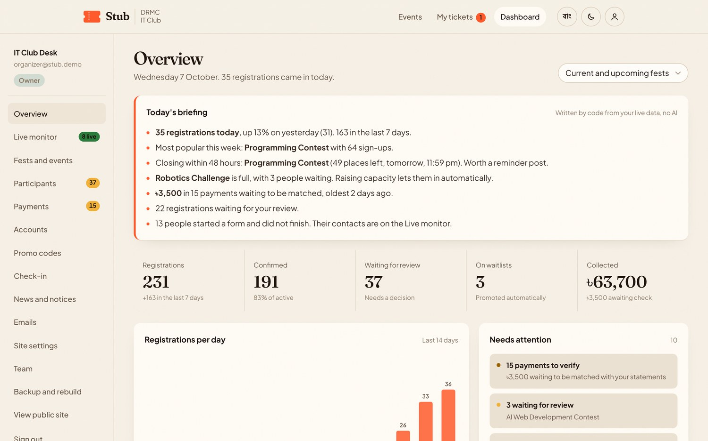<br><sub><code>3.1</code> — overview with today's briefing</sub></td>
<td width="50%">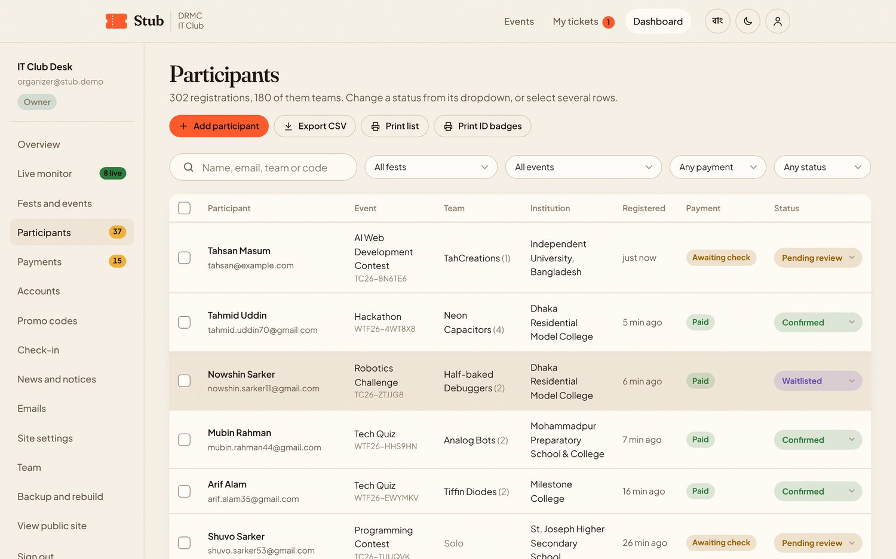<br><sub><code>3.2</code>–<code>3.4</code> — participants, filters, bulk actions</sub></td>
</tr>
<tr>
<td width="50%">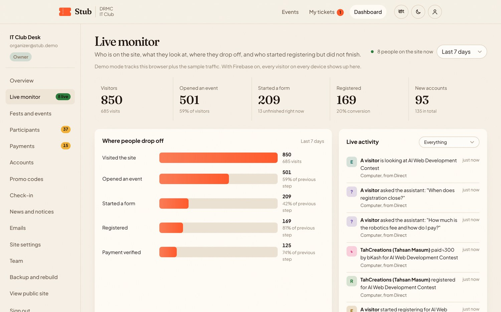<br><sub><code>3.5</code> — funnel, heatmap, unfinished forms</sub></td>
<td width="50%">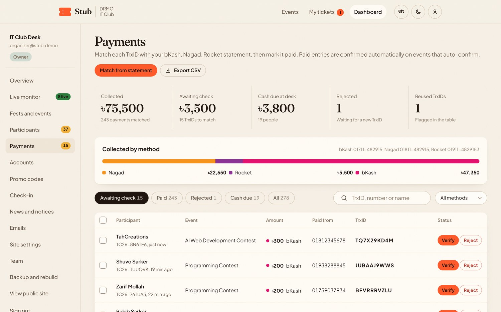<br><sub><code>3.5</code> — match TrxIDs against a bKash statement</sub></td>
</tr>
</table>

<details>
<summary><b>The rest of the dashboard</b> — events, check-in, badges, settings, roles, backups</summary>

<br>

- Create, edit, duplicate, pause or delete fests and events; set capacity, waitlist size, team size, fee, open and close times, auto-confirm and **custom questions per event**
- **Walk-in registration** at the desk, printable sign-in sheets, and **printable ID badges** for every confirmed person including teammates
- **QR check-in** from a phone camera, with a manual code box when there is no camera; already-checked-in, cancelled and unpaid tickets are all caught
- **Waitlist promotion is automatic** when a seat frees up
- **Share an event** as a printable QR poster, or to Facebook and WhatsApp — poster scans are tracked as their own traffic source
- **Site settings without code** — club name, logo upload, headline, accent colour, default theme, homepage sections on and off, FAQ, partners, contact, socials, announcement bar
- **Team roles** — Owner, Manager, Volunteer. A volunteer only ever sees check-in, ticket artwork and a read-only participant list
- **Backup and restore** the whole site as one JSON file
- **Recreate a fest for next year** — copies the fest and all its events with every date shifted forward
- **Start fresh** with a three-step setup wizard, or reload the demo data for training volunteers
- **Confirmation emails** on confirm, payment rejection and waitlist promotion, from your own no-reply address
- **Ticket design** — give an event a picture and it sits behind every ticket for it, on screen, in the PDF and on the printed badge. Reachable from **Edit event**, and from its own page that volunteers can use too

<table>
<tr>
<td width="50%">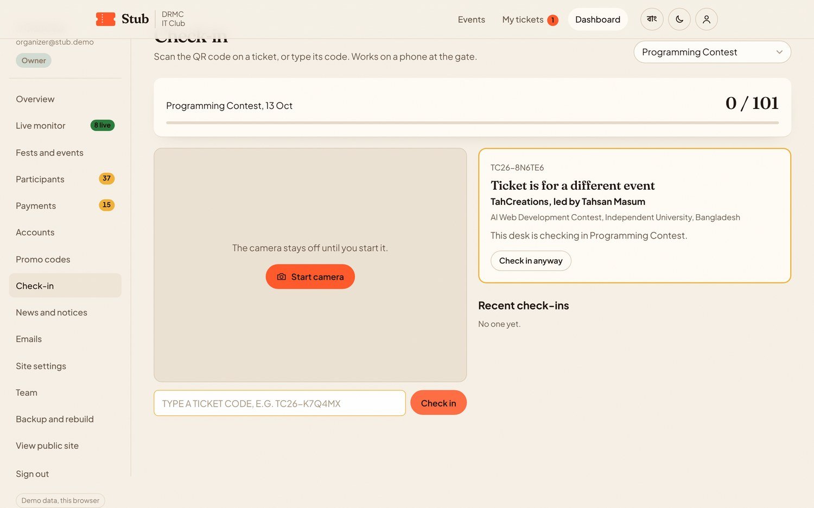<br><sub>Check-in — camera scan or typed code</sub></td>
<td width="50%">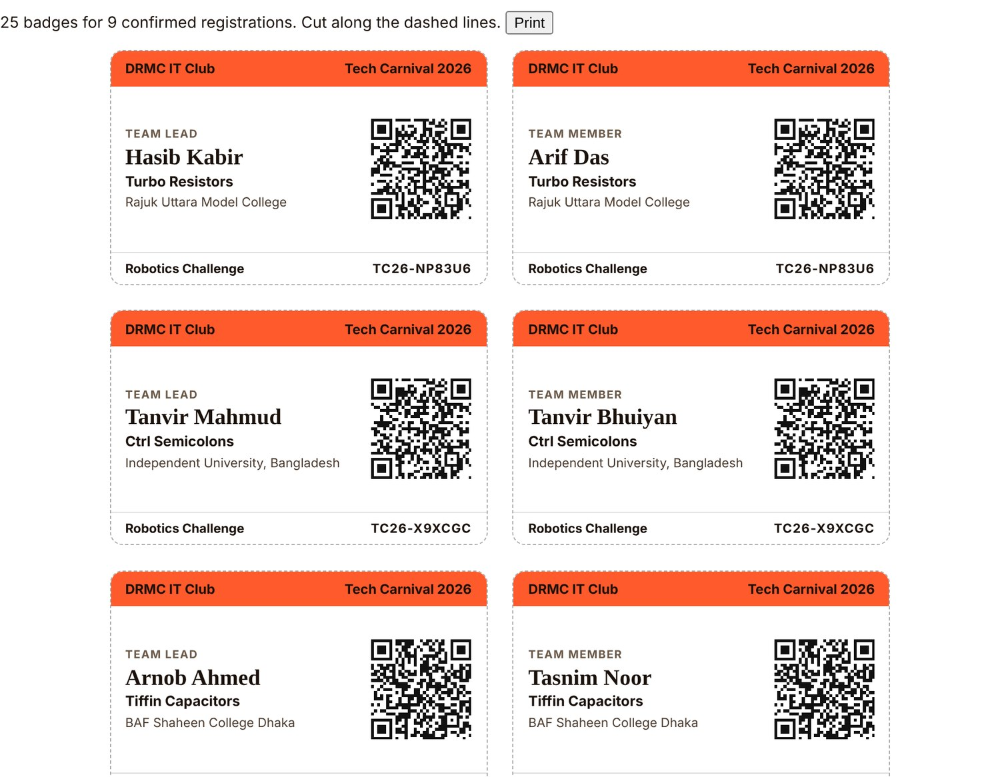<br><sub>ID badges — organizer-side only, printed before the gate opens</sub></td>
</tr>
<tr>
<td width="50%">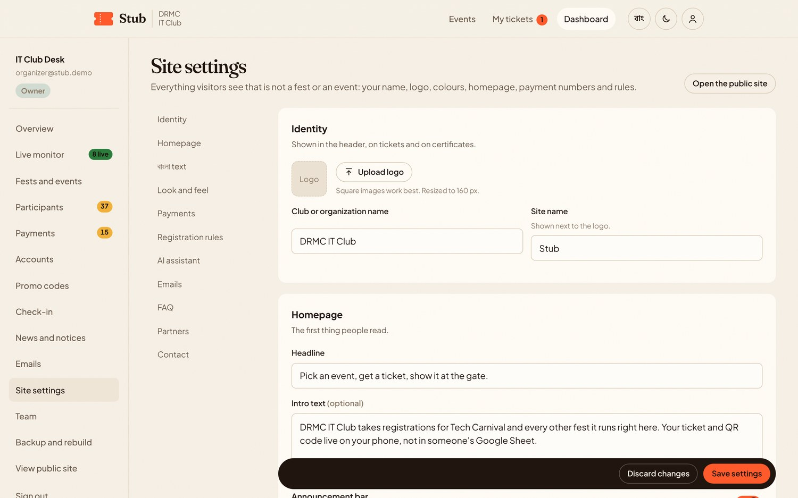<br><sub>Site settings — the whole site, no code</sub></td>
<td width="50%">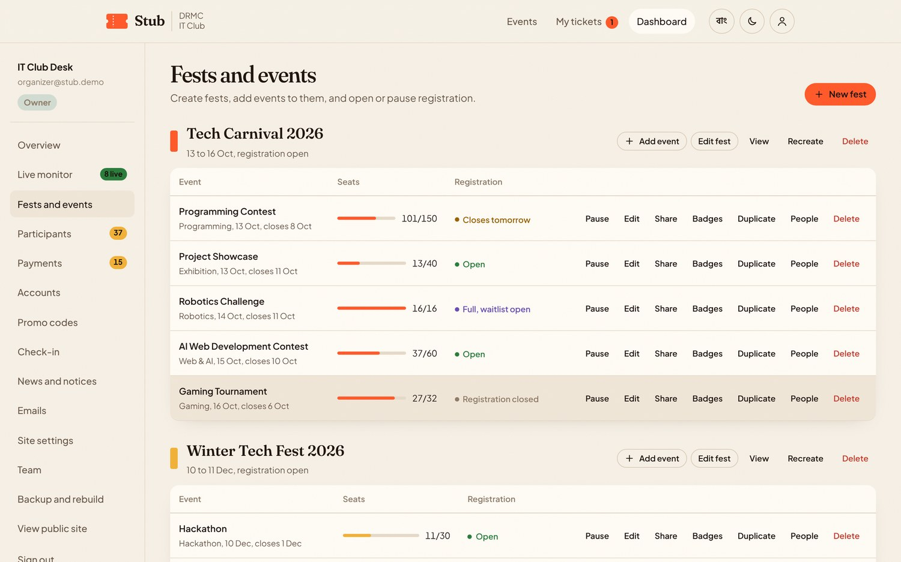<br><sub>Fests and events — capacity, fees, custom questions</sub></td>
</tr>
</table>

</details>

---

### Task 4 — Bonus (30 pts) — the extra features, ranked

> *"You can implement any creative solution of your own as extra. Creativity showcase from participants will be valued in judgement."*

**31 features beyond the brief**, ordered by how much each one actually changes the day of a real club fest. Each one is ranked and screenshotted again, line by line, in [SCORECARD.md § Task 4](SCORECARD.md#task-4--bonus--30-points).


<br>

#### 🥇 Tier 01 · Signature — the five a Google Form can never do

| | Feature | What it does |
|---|---|---|
| **01** | **bKash / Nagad payment desk** | A real money flow without a merchant API. Participant pays, submits the TrxID and the number they sent from. Organizer matches it — one at a time, or by **pasting their entire bKash statement**, which verifies every matching TrxID at once. A TrxID is blocked from being reused, in the browser *and* by a Firestore rule, so one payment can never cover two registrations |
| **02** | **QR check-in at the gate** | The ticket QR, scanned by a volunteer's phone camera, with `BarcodeDetector` and a jsQR fallback and a manual code box for when there is no camera. It catches the four things that go wrong at a real gate: already checked in, cancelled, unpaid, and wrong fest |
| **03** | **Live drop-off monitor** | Not a hit counter — a funnel: **visited → opened an event → started a form → registered → paid**, with the percentage lost at each step, who is on the site right now, a live activity feed, and a list of people who started a form and stopped, with their phone number and a one-click reminder |
| **04** | **Full বাংলা interface** | One button switches the *entire* site, not just labels — dates, seat counts, statuses, form errors, FAQ, news. Bangla typography gets its own faces and line-height, so it never looks like English text with Bangla glyphs dropped in. Organizers write Bangla versions of the headline, announcement bar, each FAQ entry and every news post |
| **05** | **AI help desk** | An **Ask** button on every public page, answering from the live event data — fees, deadlines, seats left, team sizes, payment numbers, FAQ, news and an *extra knowledge* box the organizer fills in. Runs on **Groq** (`openai/gpt-oss-120b`) through a serverless function so the key never reaches the browser, replies in Bangla when the site is in Bangla, and **falls back to built-in instant answers computed from the same data** when no key is set — so the button never breaks. Every question asked lands on the Live monitor, so organizers learn what belongs in the FAQ |

<table>
<tr>
<td width="50%">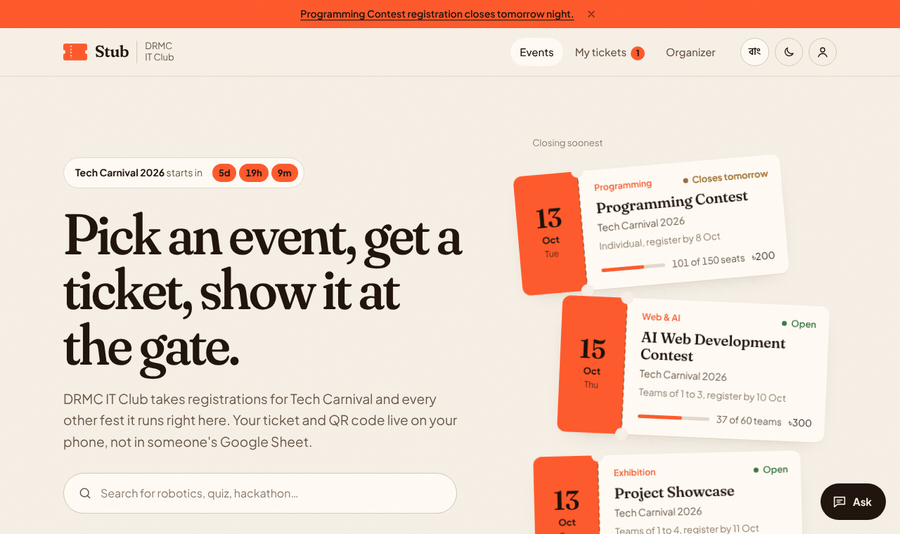<br><sub><b>05</b> — the Ask button</sub></td>
<td width="50%"><br><sub><b>04</b> — বাংলা, and the theme switch</sub></td>
</tr>
</table>

#### 🥈 Tier 02 · Major — real operational weight

| | Feature | What it does |
|---|---|---|
| **06** | **Ticket artwork** | An event carries its own picture, and it sits behind every ticket for that event — on screen, in the saved PDF and on the printed ID badge. The organizer picks the focus point and how far the picture fades into the ticket, with a **legibility floor built into the design**: however light the fade is set, a wash of ticket paper stays under the name, code and stamp, so no picture can make a ticket unreadable at the gate. Pictures are downscaled in the browser first, so a 4 MB photo lands as about 25 KB. Two doors into it — inside **Edit event** for owners and managers, and a **Ticket design** page that volunteers can reach too |
| **07** | **Promo codes** | Percent or taka off, per-event limits, usage caps, expiry dates, and a 100% code that skips payment entirely. Created by the organizer, applied live in the participant's registration form with the discount recalculated as they type |
| **08** | **Team invite links** | The team lead registers, gets a link, shares it. Each teammate opens it and fills in their own details — no more collecting six people's data in one textarea. The link stops working once the team is full |
| **09** | **Automatic waitlist** | A full event offers a waitlist instead of a dead end. When someone cancels, the next person is promoted automatically and told by email |
| **10** | **Printable ID badges** | Organizer-side only — participants never see this. After confirmation, the organizer prints badges for every confirmed person *including teammates*, with name, institution, event, role and the ticket QR, laid out for a sheet of A4, and hands them out on the day |
| **11** | **No-code site settings** | A club runs this next year without touching the code: club name, logo upload, headline, accent colour, default theme, which homepage sections appear, FAQ, partners, contact details, socials and the announcement bar — all editable from the dashboard |
| **12** | **Team roles** | Owner, Manager, Volunteer. A volunteer signed in at the gate sees **only** check-in, a read-only participant list and ticket artwork — you can hand a phone to a junior without handing over the settings |
| **13** | **Backup, restore and fest recreation** | The whole site exports as one JSON file and restores from it. **Recreate a fest for next year** copies a fest and all of its events with every date shifted forward, so Tech Carnival 2027 is three clicks, not three hours |
| **14** | **Today's briefing** | A written paragraph at the top of the dashboard — registrations today vs. yesterday, the most popular event, what closes within 48 hours, which events are full, how much money is waiting to be matched, who did not finish their form. **Generated by plain code from the live data, no AI and no API call**, so it is instant, free and never wrong |

<table>
<tr>
<td width="50%">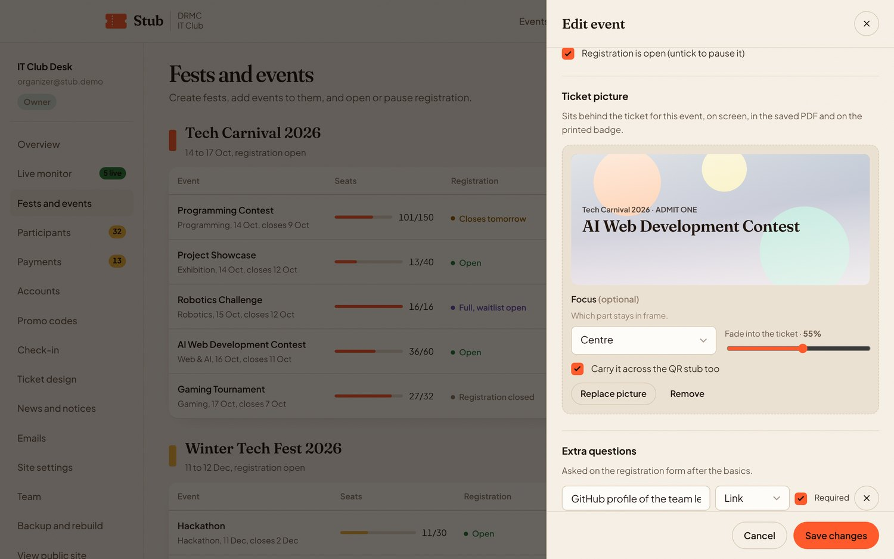<br><sub><b>06</b> — the control inside <b>Edit event</b>, with a live preview</sub></td>
<td width="50%">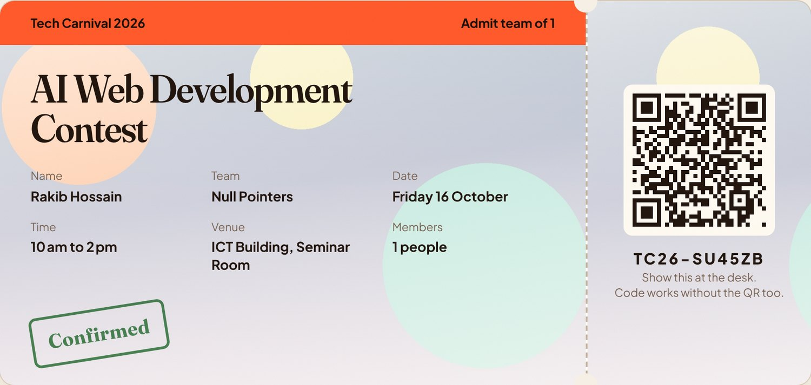<br><sub><b>06</b> — the result, text still fully readable</sub></td>
</tr>
</table>

#### 🥉 Tier 03 · Extra — rounds the product out

| | Feature | What it does |
|---|---|---|
| **15** | **Participant accounts** | Optional. Registration works fine as a guest, but an account collects every ticket in one place across events |
| **16** | **Certificates** | Participation certificates generated for checked-in participants, printable from their own account |
| **17** | **Confirmation emails** | On confirm, payment rejection and waitlist promotion, sent through Firebase's Trigger Email extension from the club's own no-reply address. In demo mode the same emails are recorded with a preview |
| **18** | **Homepage news** | Organizers post notices from the dashboard; they appear on the homepage, can be pinned, and have Bangla versions |
| **19** | **Walk-in registration** | Someone shows up at the desk without registering — the organizer adds them in ten seconds and they get a real ticket |
| **20** | **QR event posters** | Print a poster for an event with its own QR. Scans from it are tracked as a separate traffic source, so you learn whether the posters worked |
| **21** | **Dark and light theme** | A real second theme, not an inverted filter. Set a default from settings; visitors override it and it sticks |
| **22** | **Saved form progress** | A half-filled form comes back after a reload or a dropped connection — and organizers can see who started but did not finish |
| **23** | **Schedule-clash warning** | Registering for two events that overlap raises a warning before you commit |

#### ✨ Tier 04 · Polish — small things people notice

| | Feature |
|---|---|
| **24** | **Add to calendar** — a real `.ics` file from the ticket |
| **25** | **Print and PDF** — proper print stylesheets for tickets, badges, sign-in sheets, posters and certificates |
| **26** | **CSV export** — on every table in the dashboard |
| **27** | **Printable sign-in sheets** — for the gate, when phones run out of battery |
| **28** | **Visits-by-hour heatmap** — so the club learns when to post on Facebook |
| **29** | **School leaderboard** — which institutions are sending the most people |
| **30** | **Fest countdown** — live on the homepage, to the next fest |
| **31** | **Announcement bar** — a dismissible strip at the top, editable, bilingual |

<br>

#### Built to a quality floor

`Keyboard navigable` · `Focus trapped in dialogs` · `Visible focus rings` · `prefers-reduced-motion respected` · `Semantic landmarks` · `Responsive to 390 px` · `Print stylesheets throughout` · `Zero console errors across four automated test suites`

---

## 4. Tech stack

| Layer | Choice | Why |
|---|---|---|
| **Frontend** | Plain HTML, CSS and JavaScript — **no framework, no build step** | The repo is exactly what runs. Nothing to compile, nothing to go stale |
| **Routing** | Hash-based router | Deploys on any static host with zero config |
| **Data** | `Store` module with two adapters | Same interface, two backends |
| ↳ *demo* | `localStorage`, seeded on first visit, synced across tabs | Judges get a full site with no setup |
| ↳ *live* | **Cloud Firestore** with realtime listeners + **Firebase Auth** | Shared data across every device |
| **AI** | **Groq** `openai/gpt-oss-120b` via a Vercel serverless function | Key stays server-side |
| **Email** | Firebase **Trigger Email** extension | Sends from your own no-reply address |
| **Hosting** | Vercel (static + one function) | One command to deploy |
| **Type** | Fraunces · Plus Jakarta Sans · Hind Siliguri · Noto Serif Bengali | Loaded from Google Fonts |

<details>
<summary><b>Repo map</b></summary>

```
stub/
├── index.html           the entire app — UI, data layer, both backends, Firestore rules
├── api/
│   └── assistant.js     Vercel serverless function; holds the Groq key server-side
├── firestore.rules      same rules as the block inside index.html, split out for reference
├── SCORECARD.md         every rubric line → the screen that satisfies it
├── DEPLOY.md            GitHub → Vercel → Firebase, step by step
├── docs/
│   ├── banner.svg       animated hero (the QR in it is real — it scans to the live site)
│   ├── flow.svg         animated pipeline diagram
│   ├── scorecard.svg    animated judging-criteria summary
│   ├── tiers.svg        animated bonus-feature ranking
│   ├── gif/             screen recordings of the running app
│   └── img/             screenshots — desktop, tablet and phone
├── LICENSE
└── README.md
```

Inside `index.html`, the code is organised in labelled sections, in load order:

| Section | What it holds |
|---|---|
| `config` | the only part you normally edit |
| `seed` | deterministic demo data — 4 fests, 11 events, ~300 registrations |
| `store` | data layer, rules for seats/deadlines/waitlists/payments, both adapters |
| `i18n` | বাংলা / English switch |
| `ui` | drawers, dialogs, toasts, QR, calendar files, CSV |
| `public` | directory, fest, event, registration, ticket, team invites |
| `account` | participant accounts and certificates |
| `assistant` | help desk widget and the built-in answer engine |
| `admin` · `admin2` · `admin3` | organizer dashboard |
| `main` | router and app shell |

</details>

---


---

## 5. Deployment URL

> ### 🔗 **https://stub-drmc.vercel.app**

Demo mode is on, so judges get a complete site with sample data on first load and nothing to sign up for.

---

## 6. Demo credentials

Participants do **not** need an account — registration works as a guest. These are for the organizer dashboard. The sign-in page also has a one-click **Use this** link for each.

| Role | Email | Password | Sees |
|---|---|---|---|
| **Owner** | `organizer@stub.demo` | `carnival2026` | Everything, including settings, team and data |
| **Manager** | `manager@stub.demo` | `manage2026` | Events, participants, payments, promos, accounts, monitor, news, emails, check-in |
| **Volunteer** | `volunteer@stub.demo` | `gate2026` | Gate check-in, ticket artwork and a read-only participant list |
| **Participant** | `student@stub.demo` | `ticket2026` | A sample account with saved tickets |

<details>
<summary><b>Things worth trying as a judge</b></summary>

<br>

| Try this | What it shows |
|---|---|
| Register for **AI Web Development Contest** | Team event with a custom question and an invite link |
| On the payment step, enter `VOLUNTEER` | A 100% promo code that skips payment entirely |
| Or enter `WINTER30` on a Winter Tech Fest event | 30% off, with the discounted amount recalculated live |
| Register for **Programming Contest**, then **Project Showcase** | The schedule clash warning |
| Open **Robotics Challenge** | Full event → waitlist, with automatic promotion |
| Open **Gaming Tournament** / **Coding Challenge** | Deadline passed / not open yet, each with a reason |
| Reuse a transaction ID | Blocked, with a clear message |
| Dashboard → **Payments** → *Match from statement* | Paste statement text, every matching TrxID verifies at once |
| Dashboard → **Live monitor** | The funnel, the heatmap, and who did not finish their form |
| Dashboard → **Backup and rebuild** → *Recreate a fest* | Next year's fest built from this year's, dates shifted |
| Sign in as the **volunteer** account | Role limits in action — check-in and ticket artwork only |
| Press the **বাং** button anywhere | The whole site in Bangla |

</details>

---

## 7. Third-party services and APIs

| Service | Used for | License / terms |
|---|---|---|
| [Groq](https://groq.com) · `openai/gpt-oss-120b` | AI help desk answers | Groq API terms |
| [Firebase](https://firebase.google.com) — Firestore, Auth, Trigger Email | Shared live data, organizer and participant accounts, outgoing email | Firebase terms |
| [qrcode-generator](https://github.com/kazuhikoarase/qrcode-generator) | Ticket, poster and badge QR codes | MIT |
| [jsQR](https://github.com/cozmo/jsQR) | QR scanning fallback when `BarcodeDetector` is unavailable | Apache 2.0 |
| [Fraunces](https://github.com/undercasetype/Fraunces) | Display typeface | SIL OFL 1.1 |
| [Plus Jakarta Sans](https://github.com/tokotype/PlusJakartaSans) | Interface typeface | SIL OFL 1.1 |
| [Hind Siliguri](https://github.com/itfoundry/hind-siliguri) · [Noto Serif Bengali](https://fonts.google.com/noto/specimen/Noto+Serif+Bengali) | Bangla typefaces | SIL OFL 1.1 |
| Browser APIs | `BarcodeDetector`, `MediaDevices` (camera), `Clipboard`, `Web Crypto`, `IntersectionObserver`, `MutationObserver` | — |
| [Vercel](https://vercel.com) | Hosting and the serverless function | — |

Every asset in this repository is either original work, or carries one of the permissive licenses above.

---

## 8. AI tools used

**Claude (Anthropic)** was used throughout development to plan the architecture, write the code, design the interface, generate the sample data, write this README, and run automated browser tests with Playwright that walk through registration, promo codes, waitlists, team invites, payments, cancellation, organizer actions and check-in — on desktop, tablet and mobile, in both themes and both languages.

**Groq** (`openai/gpt-oss-120b`) runs *inside the product* as the help desk assistant described in [Tier 01](#-tier-01--signature--the-five-a-google-form-can-never-do). It is the only AI that runs at runtime, it only ever sees the public event data the page sends it, and the site works fully without it.

Every participant name, school, team name and transaction ID in the demo data is fictional and generated.

---

## 9. Screenshots

> All screenshots are the light theme. The site also ships a dark theme — the toggle is in the header.

<div align="center">

### The public site

<table>
<tr>
<td width="50%">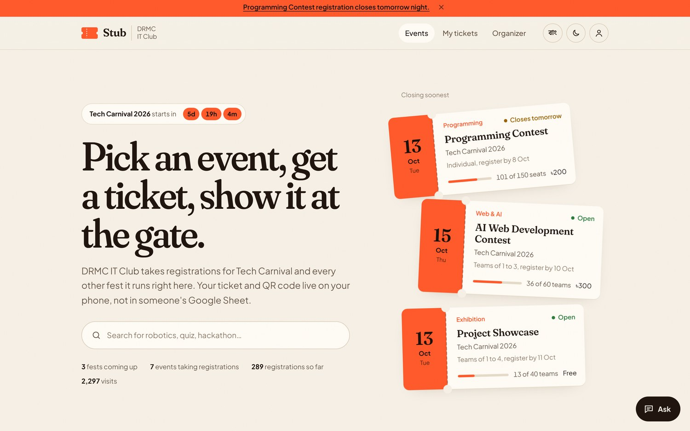<br><sub><b>Homepage</b> — countdown, fanned tickets closing soonest</sub></td>
<td width="50%"><br><sub><b>Event page</b> — rules, prizes, seat meter, live countdown</sub></td>
</tr>
<tr>
<td width="50%">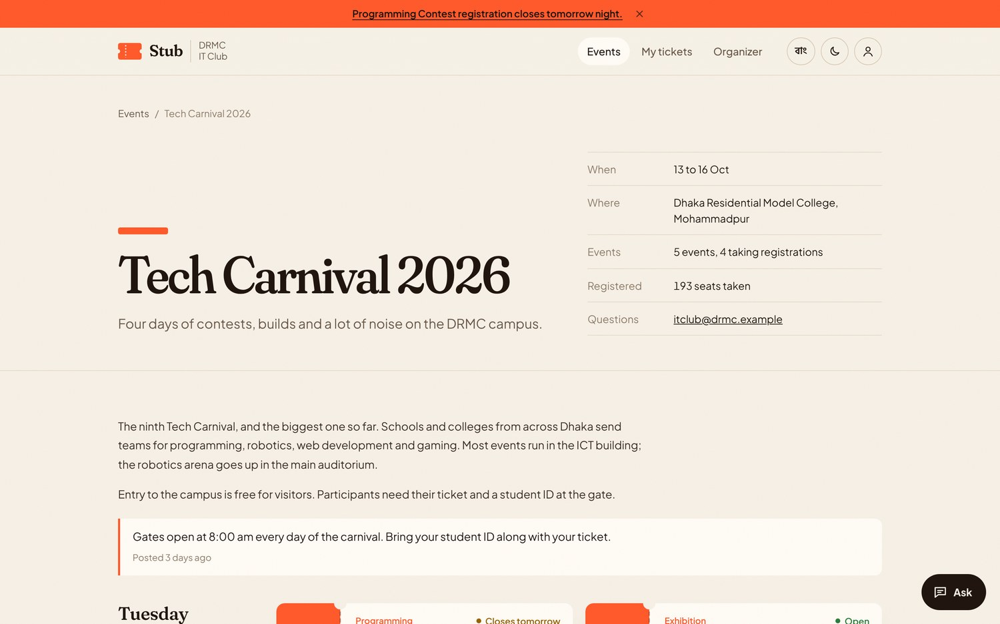<br><sub><b>Fest programme</b> — day by day</sub></td>
<td width="50%">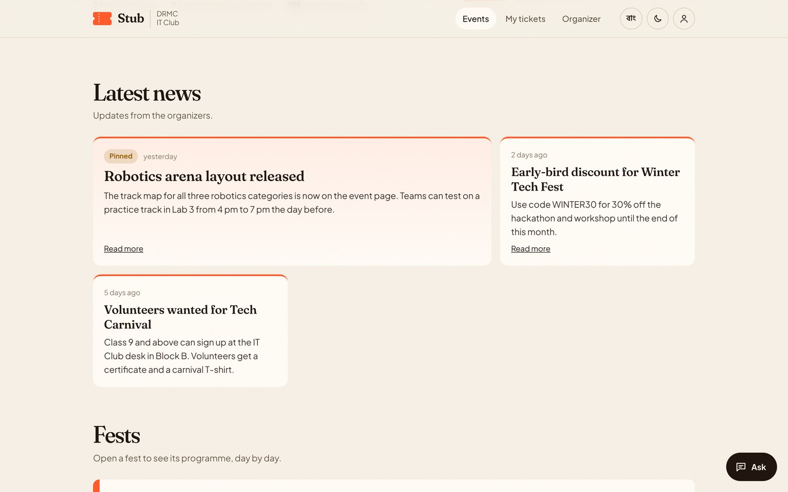<br><sub><b>News</b> — posted by organizers, pinned to the top</sub></td>
</tr>
<tr>
<td width="50%"><br><sub><b>The ticket</b> — QR, code, stamp, invite link</sub></td>
<td width="50%">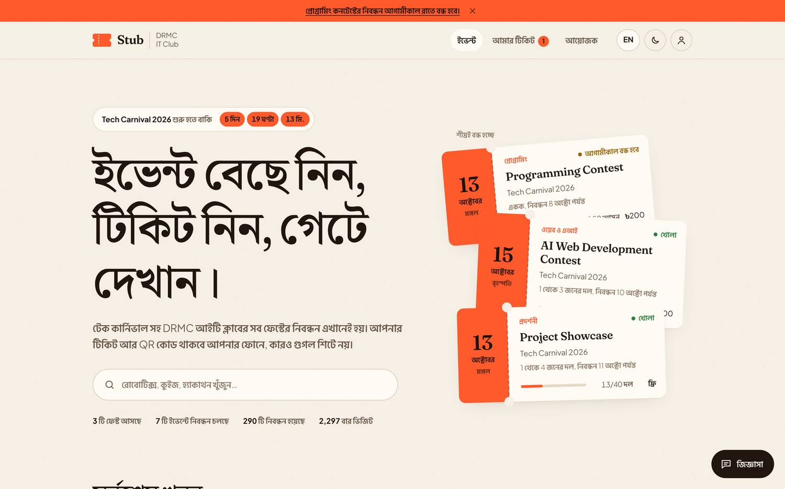<br><sub><b>বাংলা</b> — the whole interface, not just labels</sub></td>
</tr>
</table>

### The organizer dashboard

<table>
<tr>
<td width="50%"><br><sub><b>Overview</b> — today's briefing, KPIs, 14-day chart</sub></td>
<td width="50%"><br><sub><b>Live monitor</b> — funnel, live feed, unfinished forms</sub></td>
</tr>
<tr>
<td width="50%"><br><sub><b>Payments</b> — match TrxIDs against your statement</sub></td>
<td width="50%"><br><sub><b>Participants</b> — search, filter, bulk actions</sub></td>
</tr>
<tr>
<td width="50%"><br><sub><b>Check-in</b> — camera scan or typed code</sub></td>
<td width="50%">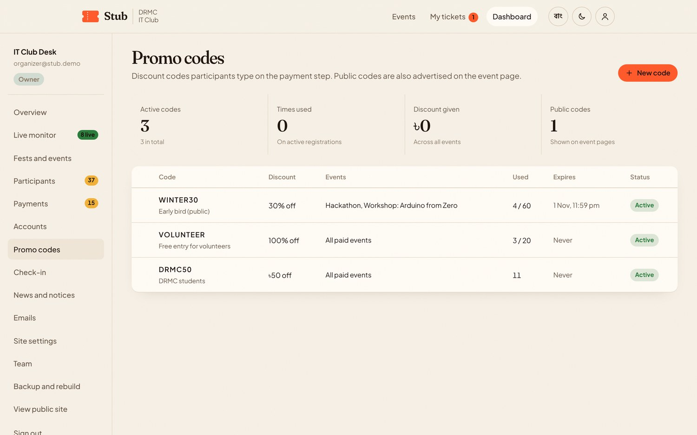<br><sub><b>Promo codes</b> — percent or taka, limits, expiry</sub></td>
</tr>
<tr>
<td width="50%">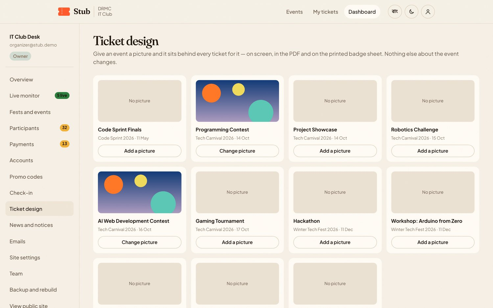<br><sub><b>Ticket design</b> — a picture per event, volunteers included</sub></td>
<td width="50%"><br><sub><b>ID badges</b> — printed before the gate opens</sub></td>
</tr>
</table>

### On a tablet

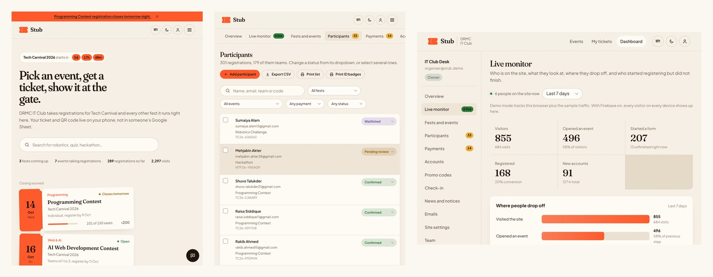

<sub>Portrait homepage · Portrait participants, rows stacked into cards · Landscape live monitor</sub>

<br><br>

### On a phone

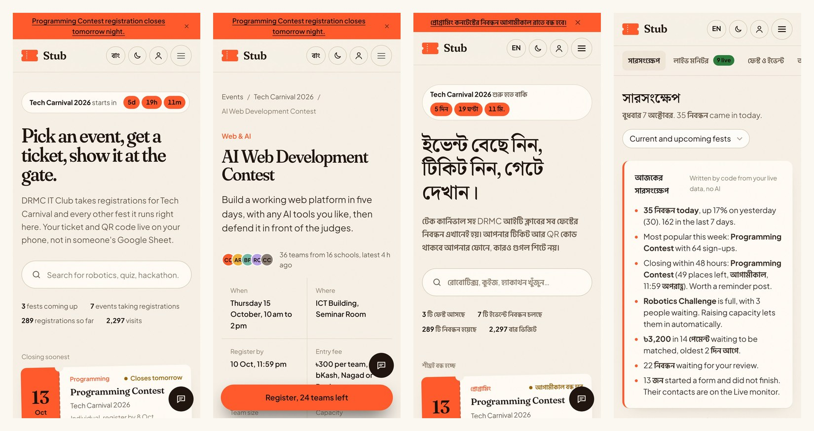

<sub>Homepage · Event page · বাংলা · Organizer dashboard — the sidebar becomes a tab strip</sub>

<br><br>

**Responsiveness was measured, not assumed.** 18 routes × 4 tablet sizes × 2 languages = **144 combinations, 0 overflow, 0 clipped containers**, plus phone and desktop passes. Details in [SCORECARD.md](SCORECARD.md#responsiveness-proof).

</div>

---


## 10. License

[MIT](LICENSE) © 2026 **Tahsan Masum Fahim**

Bundled fonts and libraries keep their own licenses, listed in [section 8](#8-third-party-services-and-apis).

---

## 11. Rules and decisions

> The organizing authority reserves the right to make the final decision regarding rule interpretation, eligibility, judging, scoring, and any matters not explicitly covered in the contest guidelines. All decisions made by the judging panel and organizing authority are final.

---

<div align="center">
<br>

**Tahsan Masum Fahim**
Department of Electrical and Electronic Engineering
Independent University, Bangladesh

[](https://github.com/tahsanmasum)
[](https://tahsanmasum.vercel.app)
[](https://linkedin.com/in/tahsanmasum)

<br>
<sub>Built for the 9th DRMC International Tech Carnival 2026 · <a href="SCORECARD.md">Judge's scorecard</a> · <a href="DEPLOY.md">Deployment guide</a></sub>

</div>
