

# Marks checklist

**Every scoring line in the rulebook, one by one: what it is worth, that it is done, and the screenshot that proves it.**

Live site · **https://stub-drmc.vercel.app** — organizer login `organizer@stub.demo` / `carnival2026`

---

## How to read this page

Each item below follows the same three lines:

> **`1.1` Display available/upcoming fests — worth 5 points.**
>
> ✅ **Completed.** What was built.
>
> *Check it:* the shortest path to see it running.

Then a screenshot of that exact thing. The requirement wording in **bold** is quoted from the rulebook.

The site loads with **4 fests, 11 events, ~300 registrations, 130 accounts and 279 payment records** already in it, so nothing on this page needs you to create data first.

> **On the ticks.** ✅ means *built, running on the live site, and shown in the screenshot below it* — it is not a mark awarded to myself. The points are yours to give.

### Running total

| Task | Lines | Points available | Lines completed |
|:--|:--:|:--:|:--:|
| **1 · Fest Directory** | 6 | 30 | **6 of 6** |
| **2 · Registration System** | 6 | 30 | **6 of 6** |
| **3 · Organizer Management** | 6 | 30 | **6 of 6** |
| **4 · Bonus — creative work** | — | 30 | **31 extra features, ranked** |
| | | **120** | |

**Fastest full sweep — about 4 minutes:**

| | Do this | Covers |
|---|---|---|
| 1 | Open the site, type `robot` in the search, click a category chip | `1.1`–`1.4` |
| 2 | Open **Robotics Challenge** from the fest page | `1.5` |
| 3 | Register for **AI Web Development Contest**, promo code `VOLUNTEER` | `2.1`–`2.3` |
| 4 | Try **Gaming Tournament** (closed) and **Robotics Challenge** (full) | `2.4` |
| 5 | Open **My tickets** → edit, then cancel | `2.5` |
| 6 | Sign in as organizer → **Overview** | `3.1`, `3.5` |
| 7 | **Participants** → search a name → change a status → select rows → bulk confirm | `3.2`–`3.4` |
| 8 | Resize the browser, or open on a phone | `1.6`, `2.6`, `3.6` |

---

# Task 1 · Fest Directory — 30 points

---

### `1.1` **Display available/upcoming fests** — worth 5 points

✅ **Completed.** Four fests on the homepage, sorted by what matters now — *happening → upcoming → past*. Each one shows its dates, venue, how many events it holds, and a live state: `Registration open`, `Coming up` or `Finished`.

*Check it:* open the live site. The fest list is the first section under the headline.

---

### `1.2` **Event cards/list contain useful information** — worth 5 points

✅ **Completed.** No card is a bare title. Every one carries the date, category, parent fest, team size, deadline, a **live seat meter**, the entry fee, and a state label — `Open`, `Closes tomorrow`, `Full, waitlist open` or `Registration closed`.

*Check it:* scroll to **All events**. Compare the Robotics Challenge card (full) with the Programming Contest card (closing tomorrow).

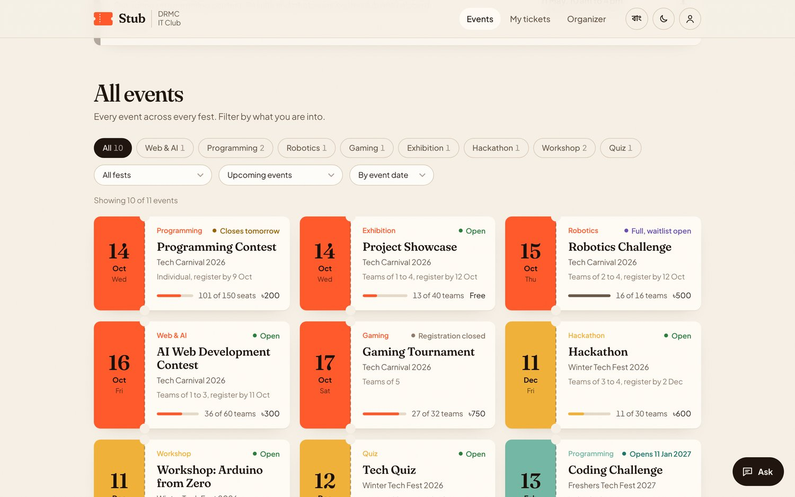

---

### `1.3` **Search events** — worth 5 points

✅ **Completed.** One search bar in the hero, filtering as you type across event titles, categories, fest names, venues and summaries.

*Check it:* type `robot` in the search bar. Then try `quiz`, or `hack`.

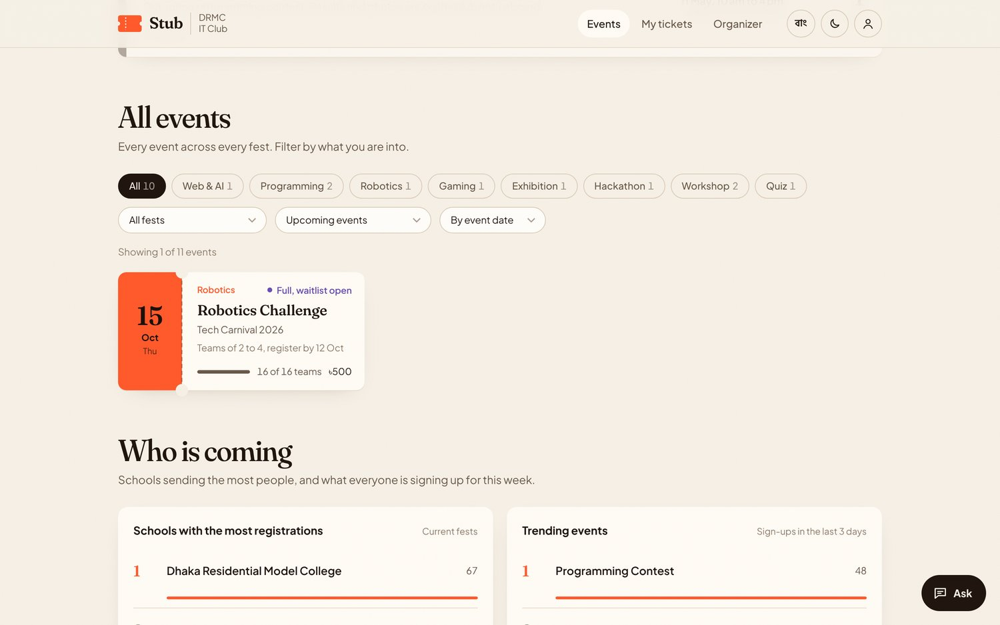

---

### `1.4` **Event categories and filter** — worth 5 points

✅ **Completed.** Category chips **with live counts**, plus three dropdowns: fest, availability (`Taking registrations` · `Closing in 48 hours` · `Full or waitlist` · `Not taking registrations` · `Everything incl. past`) and sort order (by date, by seats left, by fee).

*Check it:* click a category chip, then change the availability dropdown to *Closing in 48 hours*.

---

### `1.5` **Open an event from the fest directory to its details page showing deadline/capacity** — worth 5 points

✅ **Completed.** Every card opens a full event page. It states **Register by** (the deadline, with a live countdown) and **Capacity** in plain words — *16 teams, plus 6 on the waitlist* — alongside a fill meter, team size, entry fee, rules, prizes, venue and organizer notices.

*Check it:* open **Robotics Challenge**. The deadline and capacity are in the facts table, left of the registration panel.

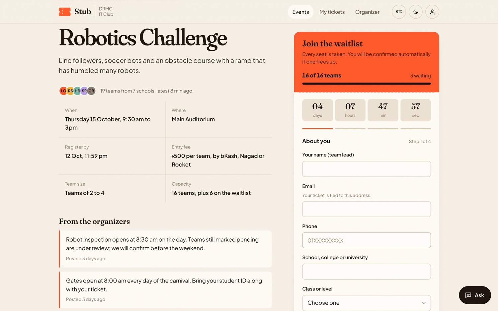

---

### `1.6` **General UX/responsiveness of this section** — worth 5 points

✅ **Completed.** Light and dark theme, বাংলা and English, keyboard navigable with visible focus rings, `prefers-reduced-motion` respected. Verified clean at 390 / 768 / 834 / 1024 / 1440 px — see the [responsiveness proof](#responsiveness-proof) at the end of this page.

*Check it:* drag the browser window narrow, or open the site on a phone.

---

# Task 2 · Registration System — 30 points

---

### `2.1` **Users can register for an event** — worth 5 points

✅ **Completed.** A four-step form on every open event — **about you → team → payment → review**. No account is needed; a guest can register and still manage the ticket afterwards.

*Check it:* open **AI Web Development Contest** and fill in the panel on the right.

---

### `2.2` **Registration form works correctly** — worth 5 points

✅ **Completed.** Inline validation on every field: Bangladeshi phone format, email shape, team size against the event's own minimum and maximum, URL answers, and transaction-ID format. Each error appears under the exact field that caused it, in its own words, and clears as soon as it is fixed. The form cannot advance past a step that still has an error.

*Check it:* type a one-letter name, `not-an-email`, and `123` as the phone, then press **Continue**.

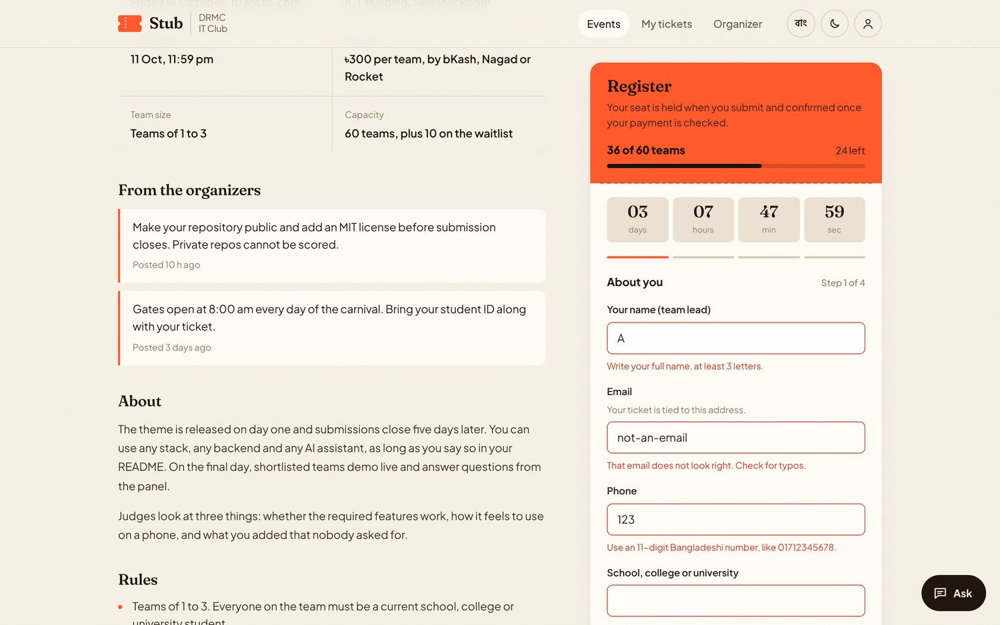

---

### `2.3` **Registration confirmation** — worth 5 points

✅ **Completed.** Submitting produces a printable **admit-one ticket** carrying a QR code, a ticket code (`TC26-…`), a status stamp and the invite link for teammates. It stays reachable at `#/tickets/<code>`, can be saved as a PDF or added to a calendar, and is emailed when email is configured.

*Check it:* complete a registration. The ticket appears immediately.

---

### `2.4` **Registration limits/deadlines work** — worth 5 points

✅ **Completed.** Four events ship in four different states so this is testable without waiting for a clock:

| Event | State | What happens |
|---|---|---|
| **Robotics Challenge** | Full | Offers the waitlist, and promotes automatically when a seat frees |
| **Gaming Tournament** | Deadline passed | Refuses, and says when it closed |
| **Coding Challenge** | Not open yet | Refuses, and says when it opens |
| **Programming Contest** | Closing within 48 h | Registers, with a countdown urging you on |

Duplicate emails on the same event are blocked, and **a transaction ID can never be used twice** — enforced in the browser *and* by a Firestore rule.

*Check it:* open **Gaming Tournament**, then **Robotics Challenge**.

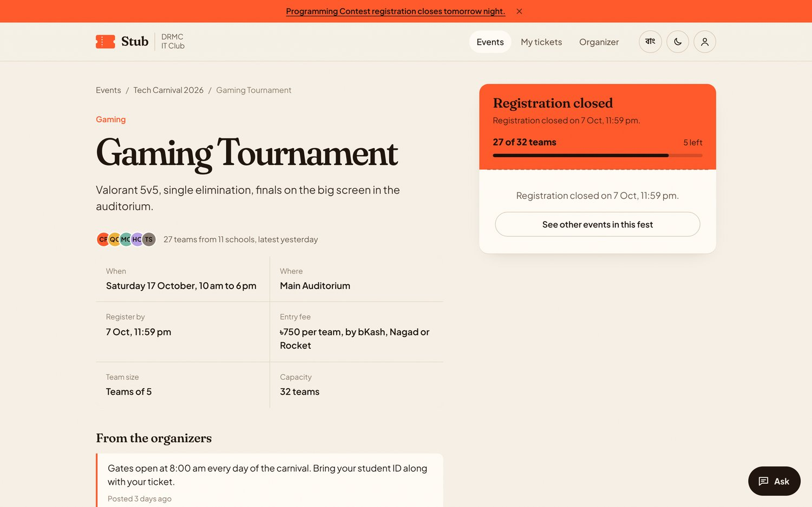

---

### `2.5` **Users can view/manage their registration** — worth 5 points

✅ **Completed.** **My tickets** lists everything this person has registered for. Each ticket can be edited, cancelled (the seat returns to the waitlist), re-submitted after a rejected payment, added to a calendar, saved as a PDF or copied as a link. On a different device, a ticket is recovered with **code + email**.

*Check it:* register, then open **My tickets** in the header.

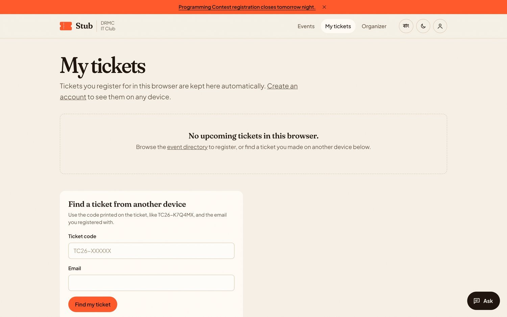

---

### `2.6` **General functionality of this section** — worth 5 points

✅ **Completed.** Progress is saved if the page reloads mid-form. A **schedule-clash warning** fires when two of your events overlap. A 100% promo code skips payment entirely. The payment step shows the exact amount, the number with a copy button, and step-by-step instructions.

*Check it:* start a form, reload the page, and come back to it. Or enter the promo code `VOLUNTEER` on the payment step.

---

# Task 3 · Organizer Management — 30 points

Sign in at **Organizer** with `organizer@stub.demo` / `carnival2026` — the sign-in page has a one-click **Use this** link.

---

### `3.1` **Organizer/admin dashboard** — worth 5 points

✅ **Completed.** A KPI row, a 14-day registration chart, a *needs attention* queue, seats by event, top institutions and the latest registrations — plus **Today's briefing**, a written summary of the day in plain language, generated by ordinary code from the live data with no AI and no API call.

*Check it:* sign in. The overview is the landing page.

---

### `3.2` **View registered participants** — worth 5 points

✅ **Completed.** The full table of all ~300 registrations: name, email, event, team, institution, when they registered, payment state and status. Clicking any row opens a detail drawer with their custom answers, team members, payment trail, full history and private organizer notes.

*Check it:* **Participants** in the sidebar. Click a row.

---

### `3.3` **Search/filter participants** — worth 5 points

✅ **Completed.** One search box spanning name, email, phone, team name, team members and ticket code, plus four dropdowns — fest, event, status and payment state — usable in any combination.

*Check it:* type part of a name in the search box, then narrow it further with the event dropdown.

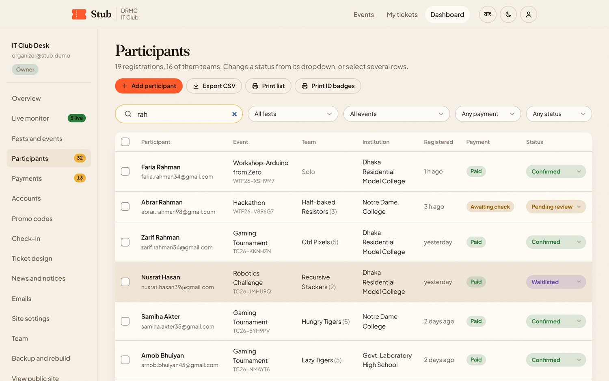

---

### `3.4` **Manage participant registration status** — worth 5 points

✅ **Completed.** Any registration's status changes inline from its own dropdown — confirmed, pending, waitlisted, rejected, cancelled, checked-in. Tick several rows and a bulk bar appears with **Confirm · Waitlist · Reject · Check in · Export**. Organizers can also add walk-ins, delete registrations, and verify or reject payments.

*Check it:* tick four rows. The bulk bar slides up at the bottom.

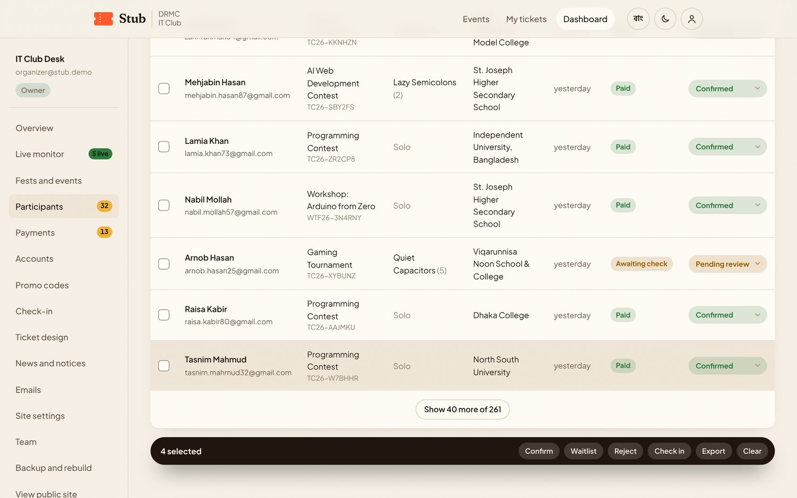

---

### `3.5` **Event/registration statistics or other useful management tools** — worth 5 points

✅ **Completed.** A drop-off funnel — *visited → opened an event → started a form → registered → paid* — with the percentage lost at each step, who is on the site right now, a live activity feed, a visits-by-hour heatmap, device and traffic-source splits, per-event conversion, money collected against money awaiting, CSV export on every table, printable sign-in sheets and ID badges, fest recreation for next year, and full backup and restore.

*Check it:* **Live monitor** in the sidebar, then **Payments**, then **Backup and rebuild**.

---

### `3.6` **General responsiveness of these tools** — worth 5 points

✅ **Completed.** On small screens the dashboard sidebar becomes a scrollable tab strip and every table becomes stacked cards rather than a sideways scroll. Verified clean at every tablet and phone size.

*Check it:* open the dashboard on a phone, or narrow the window below 900 px.

---

# Task 4 · Bonus — 30 points

> *"You can implement any creative solution of your own as extra. Creativity showcase from participants will be valued in judgement."*

✅ **Completed — 31 features beyond the brief,** ranked below by how much each one changes the day of a real club fest.

---

## 🥇 Rank 1 · Signature — the five a Google Form can never do

### `S1` bKash / Nagad payment desk

A real money flow without a merchant API. The participant pays, then submits the TrxID and the number they sent from. The organizer matches it — one at a time, or by **pasting their entire bKash statement**, which verifies every matching TrxID at once. A TrxID is blocked from ever being reused, in the browser *and* by a Firestore rule, so one payment can never cover two registrations.

### `S2` QR check-in at the gate

The ticket QR scanned by a volunteer's phone camera, with `BarcodeDetector`, a jsQR fallback, and a manual code box for when there is no camera. It catches the four things that actually go wrong at a gate: already checked in, cancelled, unpaid, and wrong fest.

### `S3` Live drop-off monitor

Not a hit counter — a funnel. **Visited → opened an event → started a form → registered → paid**, with the percentage lost at each step, who is on the site right now, and a list of people who began a form and stopped, with their phone number and a one-click reminder.

*Screenshot under [`3.5`](#35-eventregistration-statistics-or-other-useful-management-tools--worth-5-points).*

### `S4` The whole site in বাংলা

One button switches the *entire* interface, not just the labels — dates, seat counts, statuses, form errors, FAQ and news. Bangla typography gets its own faces and line-height, so it never looks like English text with Bangla glyphs dropped in. Organizers write Bangla versions of the headline, the announcement bar, each FAQ entry and every news post.

### `S5` AI help desk

An **Ask** button on every public page, answering from the live event data — fees, deadlines, seats left, team sizes, payment numbers, the FAQ, the news, and an *extra knowledge* box the organizer fills in. It runs on **Groq** (`openai/gpt-oss-120b`) through a serverless function, so the API key never reaches the browser. It replies in Bangla when the site is in Bangla, and **falls back to built-in instant answers computed from the same data** when no key is configured, so the button never breaks. Every question asked lands on the Live monitor, so organizers learn what belongs in the FAQ.

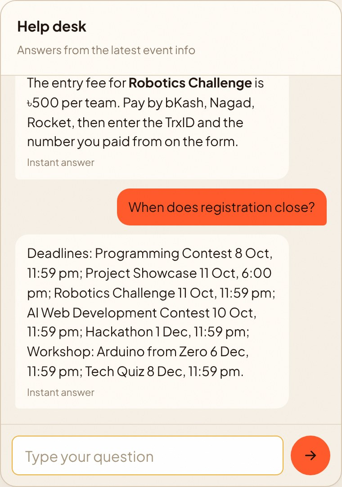

---

## 🥈 Rank 2 · Major — real operational weight

### `M1` Ticket artwork, set by the organizer

An event can carry its own picture, and it sits behind every ticket for that event — on screen, in the saved PDF and on the printed ID badge. The organizer picks the focus point and how far the picture fades into the ticket. There is a **legibility floor built into the design**: however light the fade is set, a wash of ticket paper stays under the name, code and stamp, so no choice of picture can make a ticket unreadable at the gate. Pictures are downscaled in the browser before they are stored, so a 4 MB photo lands as about 25 KB.

The control appears in two places: inside **Edit event** for owners and managers, and on its own **Ticket design** page, which **volunteers can reach too** — so the person running the gate can fix artwork without being given the power to change capacity, fees or deadlines.

<table>
<tr>
<td width="50%"> The <b>Ticket design</b> page — the door volunteers get</td>
<td width="50%"> The result on a real ticket, text still fully readable</td>
</tr>
</table>

### `M2` Promo codes

Percent or taka off, per-event limits, usage caps, expiry dates, and a 100% code that skips payment entirely. Created by the organizer, applied live in the registration form with the discount recalculated as the participant types.

### `M3` Team invite links

The team lead registers, gets a link, and shares it. Each teammate opens it and fills in their own details, instead of one person collecting six people's data into a textarea. The link stops working once the team is full.

### `M4` Automatic waitlist

A full event offers a waitlist instead of a dead end. When someone cancels, the next person is promoted automatically and told by email.

### `M5` Printable ID badges

Organizer-side only — participants never see this. After confirmation, the organizer prints badges for every confirmed person *including teammates*, each with name, institution, event, role and the ticket QR, laid out for a sheet of A4, and hands them out on the day. Event artwork from `M1` carries onto the badge.

### `M6` No-code site settings

A different club runs this next year without touching the code: club name, logo upload, headline, accent colour, default theme, which homepage sections appear, FAQ, partners, contact details, socials and the announcement bar — all editable from the dashboard.

### `M7` Team roles

Owner, Manager, Volunteer. A volunteer signed in at the gate sees **only** check-in, a read-only participant list and ticket artwork — you can hand a phone to a junior without handing over the settings.

### `M8` Backup, restore and fest recreation

The whole site exports as one JSON file and restores from it. **Recreate a fest for next year** copies a fest and all of its events with every date shifted forward, so Tech Carnival 2027 is three clicks rather than three hours.

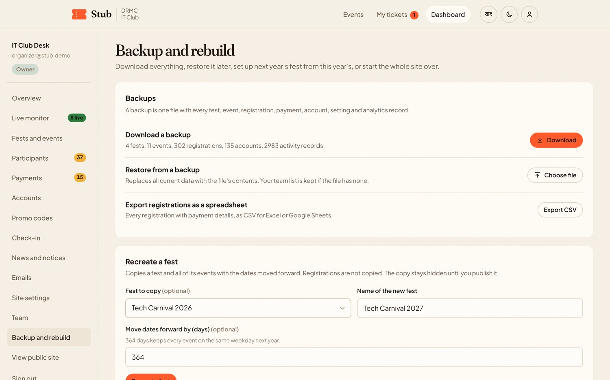

### `M9` Today's briefing

A written paragraph at the top of the dashboard — registrations today against yesterday, the most popular event, what closes within 48 hours, which events are full, how much money is waiting to be matched, and who did not finish their form. **Generated by plain code from the live data, no AI and no API call**, so it is instant, free, and never invents a number.

*Screenshot under [`3.1`](#31-organizeradmin-dashboard--worth-5-points).*

---

## 🥉 Rank 3 · Extra — rounds the product out

| | Feature | What it does |
|---|---|---|
| `E1` | **Participant accounts** | Optional. Registration works fine as a guest, but an account collects every ticket in one place across events |
| `E2` | **Certificates** | Participation certificates for checked-in participants, printable from their own account |
| `E3` | **Confirmation emails** | On confirm, payment rejection and waitlist promotion, through Firebase's Trigger Email extension from the club's own no-reply address |
| `E4` | **Homepage news** | Organizers post notices from the dashboard; they appear on the homepage, can be pinned, and have Bangla versions |
| `E5` | **Walk-in registration** | Someone shows up at the desk without registering — the organizer adds them in ten seconds and they get a real ticket |
| `E6` | **QR event posters** | Print a poster for an event with its own QR. Scans from it are tracked as a separate traffic source, so the club learns whether posters worked |
| `E7` | **Dark and light theme** | A real second theme, not an inverted filter. Set a default from settings; visitors override it and it sticks |
| `E8` | **Saved form progress** | A half-filled form comes back after a reload or a dropped connection — and organizers see who started but did not finish |
| `E9` | **Schedule-clash warning** | Registering for two events that overlap raises a warning before you commit |

<table>
<tr>
<td width="50%"> <code>E4</code> — news from the organizers</td>
<td width="50%">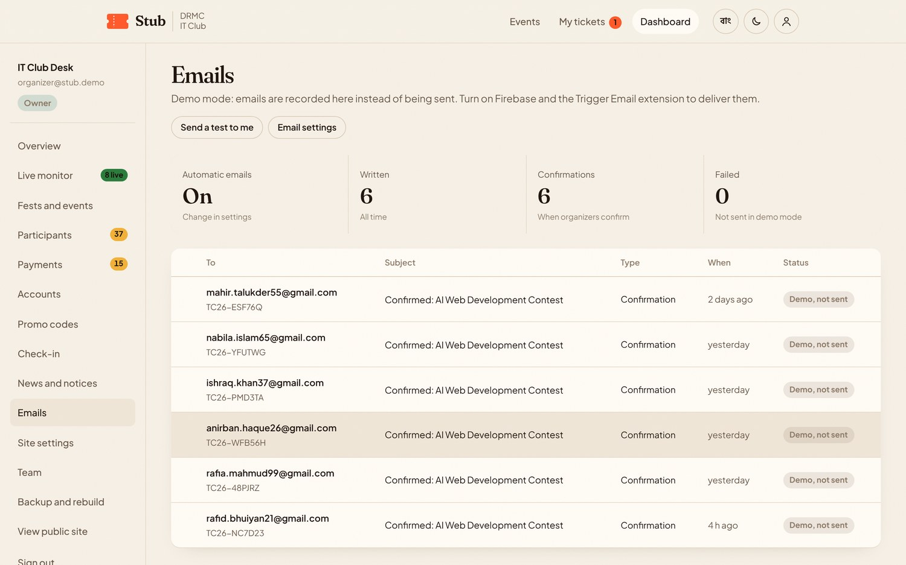 <code>E3</code> — confirmation emails and their status</td>
</tr>
</table>

---

## ✨ Rank 4 · Polish — small things people notice

| | Feature |
|---|---|
| `P1` | **Add to calendar** — a real `.ics` file from the ticket |
| `P2` | **Print and PDF** — proper print stylesheets for tickets, badges, sign-in sheets, posters and certificates |
| `P3` | **CSV export** — on every table in the dashboard |
| `P4` | **Printable sign-in sheets** — for the gate, when phones run out of battery |
| `P5` | **Visits-by-hour heatmap** — so the club learns when to post on Facebook |
| `P6` | **School leaderboard** — which institutions are sending the most people |
| `P7` | **Fest countdown** — live on the homepage, to the next fest |
| `P8` | **Announcement bar** — a dismissible strip at the top, editable and bilingual |

---

# Submission guidelines

Everything the rulebook requires of the submission itself.

| Requirement | Status | Evidence |
|---|---|---|
| Codebase entirely open source | ✅ | This repository, no private dependencies |
| Pushed to a **public** GitHub repository | ✅ | Repository visibility set to Public |
| Repository includes an **MIT License** | ✅ | [`LICENSE`](LICENSE) |
| Working **deployment URL** so judges need not run it locally | ✅ | https://stub-drmc.vercel.app |
| Deployed app contains **sufficient sample data** | ✅ | 4 fests · 11 events · ~300 registrations · 130 accounts · 279 payments · 26 team invites · 3 promo codes — all present on first load |
| Judges not required to create initial fests/events/participants | ✅ | Demo data loads automatically; organizers can reset or reload it from **Backup and rebuild** |
| Backend functional until the evaluation date | ✅ | Demo mode has no backend to fail. Firebase mode is additive and falls back to demo mode if it cannot start |
| Third-party assets comply with their licenses | ✅ | [README section 8](README.md#8-third-party-services-and-apis) lists every library, font and service with its license |
| AI tools disclosed | ✅ | [README section 9](README.md#9-ai-tools-used) |
| **Fully responsive across mobile, tablet and desktop** | ✅ | See below |
| README with all 13 required sections | ✅ | [README.md](README.md) — numbered 1 to 13 |

---

## Responsiveness proof

The rulebook asks for *"fully responsive and functional across all screen sizes (mobile, tablet, and desktop)"*. Each of **18 routes** was checked at **4 tablet sizes × 2 languages** for page overflow and clipped containers, plus phone and desktop passes.

| Class | Sizes verified | Result |
|---|---|---|
| **Mobile** | 390 × 844 | Nav collapses to a sheet, sticky register button, stacked tables, QR check-in usable one-handed |
| **Tablet** | 768 × 1024 · 834 × 1194 · 820 × 1180 · 1024 × 768 | **144 route × size × language combinations, 0 overflow, 0 clipped containers** |
| **Desktop** | 1280 × 800 · 1440 × 900 | Full two-column layouts, sidebar dashboard |

All of it is re-runnable: six automated Playwright suites cover the public flow, Firebase mode against a stub SDK, mobile, tablet, the Groq assistant, and ticket artwork. Every one finishes with zero console errors and zero page errors.

 Tablet portrait, tablet portrait with stacked participant rows, and tablet landscape

---

Back to <a href="README.md">README</a> · <a href="DEPLOY.md">Deployment guide</a>

